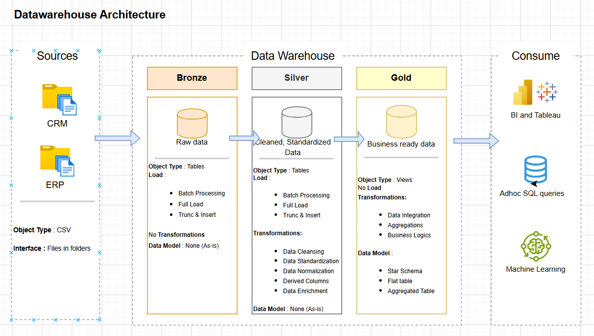

# 🗂️ Data Warehouse Project

Welcome! This is a data warehouse and analytics project I built by following a YouTube tutorial. It demonstrates the process of building a data warehouse and performing basic data analysis using SQL Server.

---

## 📌 Project Highlights

- Built using **Medallion Architecture** with **Bronze, Silver, and Gold layers**
- Processed data from CSV files (ERP and CRM systems)
- Created ETL pipelines using SQL
- Modeled data into fact and dimension tables
- Generated insights using SQL queries

---

## 🏗️ Architecture Overview

### 🔸 Bronze Layer  
Raw data is imported from CSV files into SQL Server.

### 🔹 Silver Layer  
Data is cleaned, standardized, and prepared for analysis.

### 🟡 Gold Layer  
Data is modeled into a **Star Schema** with fact and dimension tables for reporting.

---

## 🧪 Tools Used

- SQL Server Express  
- SQL Server Management Studio (SSMS)  
- CSV files (provided in the project)  
- Git & GitHub  
- Draw.io (for architecture diagrams)

---

## 📊 Insights Generated

- Customer Behavior  
- Product Performance  
- Sales Trends  

All insights are created using simple SQL queries.

---
